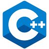
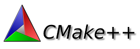
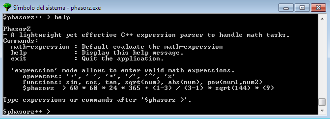
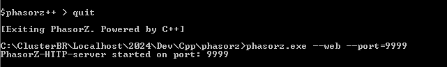
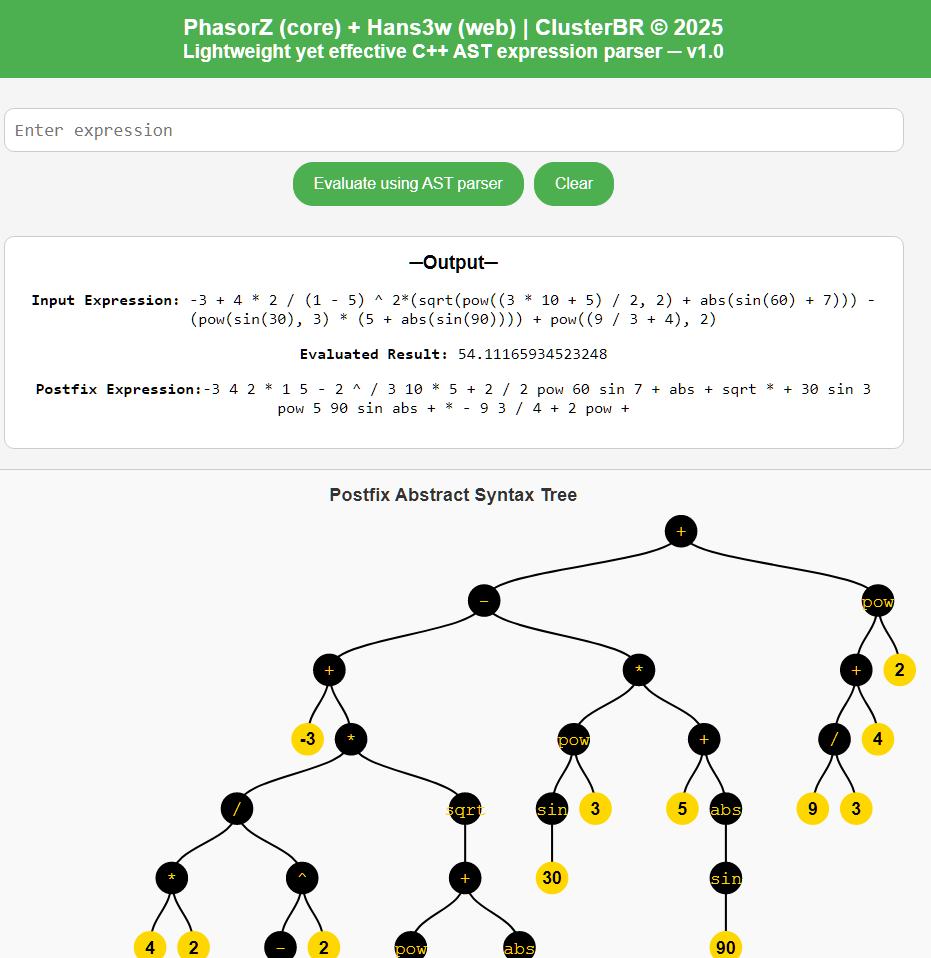
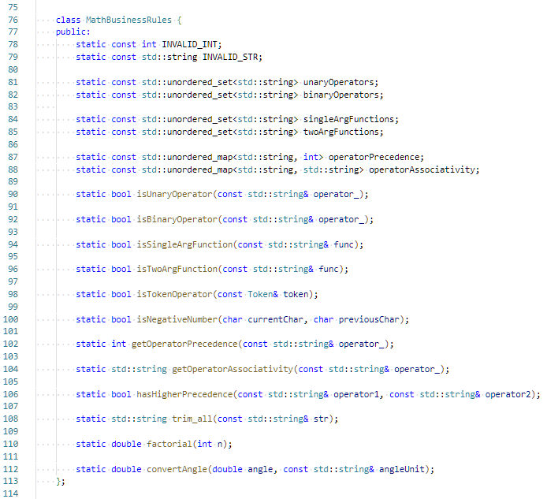
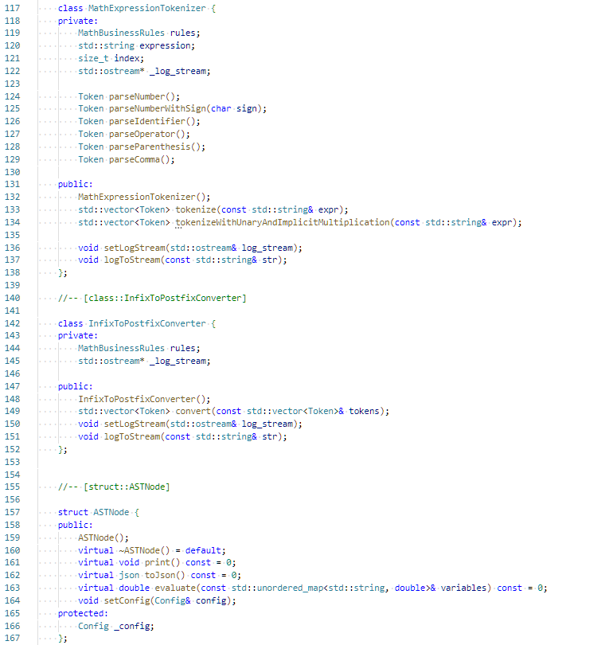
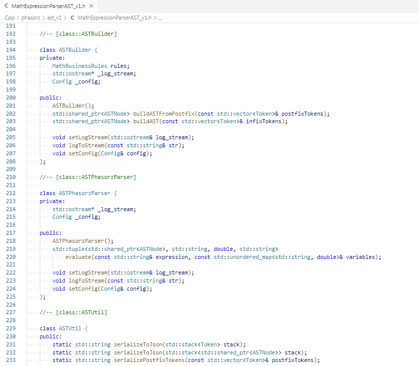

# PhasorZ & Hansw3







___

**|PhasorZ + Hans3w|** is a light-weight yet robust, modern C++ application designed to parse, compute, and visualize mathematical expressions.
    
**PhasorZ** handles the core mathematical parser, while **Hans3w** is the http-web application.

> See live app at render-cloud-engine: https://phasorz-hans3w-1.onrender.com

The application can be executed either as a command-line utility or as a HTTP-web application, generating dynamically interactive results, for math-expression evaluation and Abstract Syntax Tree (AST) visualization.

This application was implemented in `C++17`, making use of the expressiveness,
multiparadigm-approach and efficiency of `C++`, encapsulating everything into a single executable that
*can run on modern Linux and Windows operating systems as well as in docker-containers and cloud-engines*.

## Executable Versions (DIST)

> **Repository for Distributable Version!**

- **Web-Server docker container ready to deploy in any Cloud-engine or on-premise container-environment**: https://github.com/users/abritoh/packages/container/phasorz-hans3w/versions
- **Executable versions for Linux and Windows will be placed in this GitHub repository**: https://github.com/abritoh/phasorz-dist

## Abstract Syntax Tree ─ AST

- A **Math Expression AST Parser** takes a mathematical expression and converts it into an AST, which is a tree structure representing the expression's components. The parser can then evaluate, simplify, or transform the expression. 
- Compilers and interpreters heavily rely on AST parsers to translate source code into an internal representation that can be analyzed, optimized, and ultimately executed.
- In addition to compilers and interpreters, AST parsers are used in various other applications:
  - **Code analysis and refactoring**: ASTs enable static code analysis tools.
  - **Code generation**: ASTs can be transformed into other programming languages or intermediate representations. For example, JavaScript code can be compiled into machine code or bytecode for platforms like Node.js or browsers.
  - **Mathematical Expression Evaluation**: As discussed earlier, ASTs are used in parsers for mathematical expression solvers, symbolic algebra systems (e.g., Wolfram Alpha, SymPy), and calculators.
  - **Documentation generation**: Tools like Javadoc use ASTs to extract documentation comments from code and generate API documentation.
  - **Security analysis**: ASTs are used in security tools (e.g., static analyzers) to check for vulnerabilities or unsafe code patterns by understanding the structure of the code.

## Execute PhasorZ as CLI Utility

```
> phasorz.exe 
```





## Execute PhasorZ as WebServer (Hansw3)

- Port parameter is optional (--port=9090), 
- If no port parameter provided will use the provided by environmental-variables (PORT).
- Otherwise will use the default application port (9090).
- To run the Http server-mode the folder **web** is required
- And must be in the same folder as the **phasorz.exe** (Windows) or **phasorz** (Linux) executable
- The executable is near to 1MB large, plus the size of the **web** folder.

```
> phasorz.exe --web [--port=9090]
```





## Math operations and functions for PhasorZ version 1.0

```
PhasorZ
- A lightweight yet effective C++ expression parser to handle math tasks.
Commands:
  math-expression : Default evaluate the math-expression
  help            : Display this help message.
  exit            : Quit the application.

  'expression' mode allows to enter valid math expressions.
     operators: '+', '-', '*', '/', '^', '%'
     functions: sin, cos, tan, sqrt(num), abs(num), pow(num1,num2)
     $phasorz  > 60 * 60 * 24 * 365 + (1-3) / (3-1) * sqrt(144) * (9)

Type expressions or commands after '$phasorz >'.
```

## Deploying PhasorZ-Hansw3 to a Docker container

Use the Dockerfile in this repo to build and deploy the application to Docker-environment

Find below is Dockerfile file content-replicated for reference purposes:

```shell
#-------------------------------------------------------------------------------------------
#-- This Dockerfile contains the required steps to build the containerized
#-- version of the "phasorz-has3w" application.
#-- Use the distributable "phasorz-linux-ubuntu-dist" version from this repo
#-- to build and deploy the Docker container to your Docker environment by running:
#-- 
#-- docker build -t $GH_IMAGE_NAME:$IMAGE_TAG .
#-- docker push $GH_IMAGE_NAME:$IMAGE_TAG
#-- 
#-- Where:
#--     $GH_IMAGE_NAME - the name of the Docker image for the specific Docker registry
#--     $IMAGE_TAG - the tag for versioning (e.g., 1.0)
# 
# arcbrth@gmail.com | ClusterBR (c) 2025
#-------------------------------------------------------------------------------------------

FROM ubuntu:latest

WORKDIR /app

COPY phasorz /app/
COPY web /app/web/

RUN ls -l /app
RUN ls -l /app/web

#-- The exposed port where the app is listening. Change this port to your desired port.
EXPOSE 10000

RUN chmod +x /app/phasorz

#-- The port specified in EXPOSE should match the app's internal port.
#-- Change the application port parameter as needed (e.g. --port=8080).

ENTRYPOINT ["/app/phasorz", "--web", "--port=10000"]
```


## Hansw3 http-web application dependencies

- **Hansw3** *http-web application* uses the following C++ dependencies:- 
  - **cpp-httplib**: https://github.com/yhirose/cpp-httplib
  - **nlohmann-json**: https://github.com/nlohmann/json
- This dependencies are just needed during compilation
- During execution no external dependencies are required.


## Source-code Screenshots








_____


## Compilation and Building 

[*This is the distributable version, this section is for the source-code repository-version*]

- Ensure to have a C++ compiler like GCC

```shell
> g++ --version

g++ (MinGW-W64 x86_64-ucrt-posix-seh, built by Brecht Sanders, r1) 14.2.0
Copyright (C) 2024 Free Software Foundation, Inc.
This is free software; see the source for copying conditions.  There is NO
warranty; not even for MERCHANTABILITY or FITNESS FOR A PARTICULAR PURPOSE.
```

- To compile on Linux use **Makefile.linux**
- To compile on Windows use **Makefile.windows**

```shell
> mingw32-make rebuild -f Makefile.windows

g++ -std=c++17 -O1 -MMD -MMD -c main.cpp -o main.o
g++ -std=c++17 -O1 -MMD -MMD -c app_cli/kshell.cpp -o app_cli/kshell.o
g++ -std=c++17 -O1 -MMD -MMD -c kmatrix/KException.cpp -o kmatrix/KException.o
g++ -std=c++17 -O1 -MMD -MMD -c kmatrix/KMatrix.cpp -o kmatrix/KMatrix.o
g++ -std=c++17 -O1 -MMD -MMD -c kmatrix/KVector.cpp -o kmatrix/KVector.o
g++ -std=c++17 -O1 -MMD -MMD -c test/KMatrixTest.cpp -o test/KMatrixTest.o
g++ -std=c++17 -O1 -MMD -MMD -c test/KVectorTest.cpp -o test/KVectorTest.o
g++ -std=c++17 -O1 -MMD -MMD -c test/test_ast_v1.cpp -o test/test_ast_v1.o
g++ -std=c++17 -O1 -MMD -MMD -c util/app_data.cpp -o util/app_data.o
g++ -std=c++17 -O1 -MMD -MMD -c ast_v1/MathExpressionParserAST_v1.cpp -o ast_v1/
MathExpressionParserAST_v1.o
g++ -std=c++17 -O1 -MMD -MMD -c ast_server/Hans3wServer.cpp -o ast_server/Hans3w
Server.o
g++ main.o app_cli/kshell.o kmatrix/KException.o kmatrix/KMatrix.o kmatrix/KVect
or.o test/KMatrixTest.o test/KVectorTest.o test/test_ast_v1.o util/app_data.o as
t_v1/MathExpressionParserAST_v1.o ast_server/Hans3wServer.o -o phasorz.exe -lstd
c++ -lgcc -lws2_32
```


> arcebrito@gmail.com | ClusterBR (c) 2025

